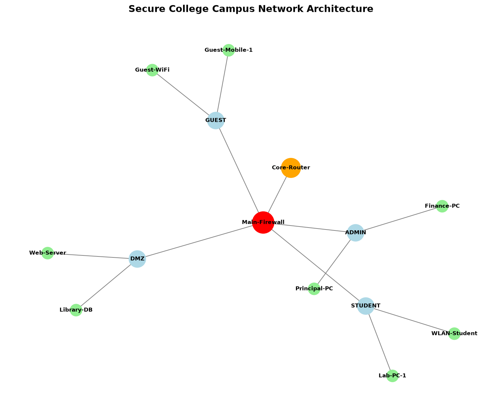

# Secure College Network Simulation

Secure campus network simulation with custom firewall ACL rules and topology visualization using Python (NetworkX + Matplotlib).

## Network Topology

## Features
- VLAN-based network zone segmentation (DMZ, ADMIN, STUDENT, GUEST)
- Firewall ACL rule engine with Zero-Trust default-deny policy
- Real-time packet inspection simulation
- Visual network topology graph

## Zones
- **DMZ** — Semi-public servers (Web-Server, Library-DB)
- **ADMIN** — Highly restricted (Finance-PC, Principal-PC)
- **STUDENT** — Academic access (Lab-PC-1, WLAN-Student)
- **GUEST** — Internet access only (Guest-Mobile-1, Guest-WiFi)

## How to Run
python main.py